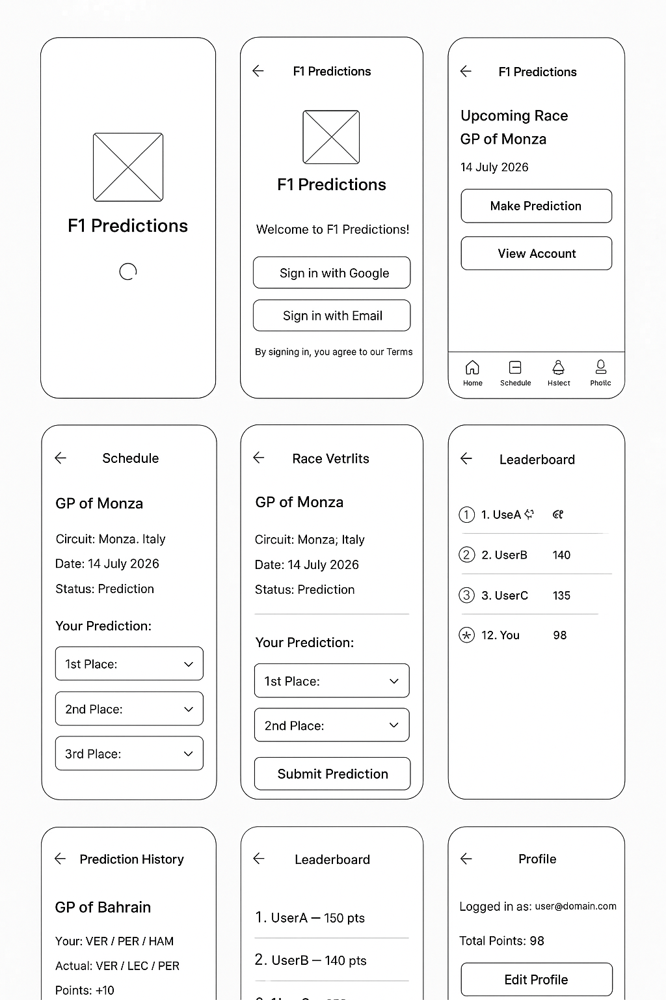

# 🏎️ F1 Schedule Predictions — Mobile App

This repository contains the **mobile version** of the [F1 Schedule Predictions](https://github.com/larisagherman/f1_schedule_predictions) web application.  
The mobile app allows Formula 1 fans to view race schedules, make race predictions, and compete on a global leaderboard — directly from their mobile devices.

---

## 📱 Overview

The original project was built as a web app using **React** and **Firebase**.  
This mobile app is a cross-platform version built using **React Native (Expo)**, allowing deployment on both **iOS** and **Android**.

All core functionalities from the web app are retained, with UI and navigation optimized for mobile interaction.

---

## ⚙️ Architecture

| Component | Description |
|------------|-------------|
| **Frontend** | React Native (Expo) — manages navigation, UI rendering, and Firebase integration |
| **Backend** | Firebase (Authentication, Firestore Database, Hosting, and Functions) |
| **Navigation** | React Navigation (Stack + Tab Navigation) |
| **Authentication** | Google Sign-In and Email/Password Auth |
| **Data Sync** | Firebase Realtime Database / Firestore |
| **Push Notifications** | (Optional) Expo Notifications for race reminders and results |

---

## 🧩 Key Features

- **View upcoming races** with details (name, date, location, and status)
- **Submit race predictions** before the race starts
- **View prediction history** (compare your predictions with actual results)
- **Leaderboard** — track your score and see top users
- **Profile & Settings** — manage account info, sign out, and access app info
- **Admin Controls** (for admin users only):
  - Add, edit, and delete races
  - Open/close prediction windows

---

## 🧭 Navigation Flow

```
Splash → Login / Sign Up → Home
         ↓
   (Tabs: Schedule | History | Leaderboard | Profile)
         ↓
  Race Details → Prediction Form
         ↓
     Submit / View Results
```

---

## 🧱 Screens & Wireframes

Below are **low-fidelity text-based wireframes** representing the structure and layout of each screen.



---

### 🏁 1. Splash / Launch Screen
```
---------------------------------
| [Logo / App Name]             |
| "F1 Predictions"              |
| Loading indicator...           |
---------------------------------
```

---

### 🔐 2. Login / Sign Up
```
---------------------------------
| [App Logo]                    |
| Welcome to F1 Predictions!    |
---------------------------------
| [ Sign in with Google ]       |
| [ Sign in with Email ]        |
| [ Create an Account ]         |
---------------------------------
| "By signing in, you agree to our Terms." |
---------------------------------
```

---

### 🏠 3. Home / Dashboard
```
---------------------------------
| [Header: "F1 Predictions"]    |
---------------------------------
| Upcoming Race: GP of Monza    |
| Date: 14 July 2026            |
| [ Make Prediction → ]         |
---------------------------------
| [View Leaderboard] [My History] |
---------------------------------
| Bottom Tabs:                  |
| Home | Schedule | History | Profile |
---------------------------------
```

---

### 📅 4. Schedule Screen
```
---------------------------------
| ← Back | Schedule             |
---------------------------------
| [ Race Card 1 ]               |
| GP of Bahrain — 03 Mar 2026   |
| Status: Upcoming              |
| [ View Details → ]            |
---------------------------------
| [ Race Card 2 ]               |
| GP of Australia — 17 Mar 2026 |
| Status: Closed                |
---------------------------------
```

---

### 🏎️ 5. Race Details & Prediction
```
---------------------------------
| ← Back | GP of Monza          |
---------------------------------
| Circuit: Monza, Italy         |
| Date: 14 July 2026            |
| Status: Prediction Open       |
---------------------------------
| 🧠 Your Prediction:            |
| 1st Place: [Dropdown]         |
| 2nd Place: [Dropdown]         |
| 3rd Place: [Dropdown]         |
| [ Submit Prediction ]         |
---------------------------------
| (If closed:)                  |
| Your Prediction: VER / HAM / NOR |
| Actual Results: VER / LEC / RUS |
---------------------------------
```

---

### 🕒 6. Prediction History
```
---------------------------------
| ← Back | Prediction History   |
---------------------------------
| [ Race Card ]                 |
| GP of Bahrain                 |
| Your: VER / PER / HAM         |
| Actual: VER / LEC / PER       |
| Points: +10                   |
---------------------------------
| [ Race Card ]                 |
| GP of Australia               |
| Your: HAM / NOR / LEC         |
| Actual: VER / PER / RUS       |
| Points: +5                    |
---------------------------------
```

---

### 🏆 7. Leaderboard
```
---------------------------------
| ← Back | Leaderboard          |
---------------------------------
| 1. UserA — 150 pts 🥇          |
| 2. UserB — 140 pts 🥈          |
| 3. UserC — 135 pts 🥉          |
| ...                           |
| 12. You — 98 pts ⭐             |
---------------------------------
```

---

### 👤 8. Profile / Settings
```
---------------------------------
| ← Back | Profile              |
---------------------------------
| Logged in as: user@domain.com |
| Total Points: 98              |
---------------------------------
| [ Edit Profile ]              |
| [ About App ]                 |
| [ Sign Out ]                  |
---------------------------------
| (Admin Options)               |
| [ Manage Races ]              |
| [ Enable Predictions ]        |
---------------------------------
```

---

## 🧠 Design Philosophy

- Clean, **minimalistic UI** with race branding colors (red, black, and white).
- **Tab-based navigation** for fast access between major sections.
- Designed for **one-hand use** — key buttons within thumb reach.
- **Accessible and responsive**, supporting both light/dark modes.

---

## 🧰 Tech Stack

| Layer | Technology |
|--------|-------------|
| Framework | React Native (Expo) |
| Backend | Firebase |
| Navigation | React Navigation |
| UI Components | NativeBase / React Native Paper |
| Auth | Firebase Auth |
| Database | Firestore |
| Notifications | Expo Notifications |
| Deployment | Expo EAS |

---

## 🚀 Future Improvements

- Offline mode with local cache
- Push notifications before race deadlines
- Share your predictions with friends
- Enhanced admin dashboard
- Integration with official F1 API for live results

---

## 👩‍💻 Contributors

| Name | Role |
|------|------|
| [LARISA GHERMAN](https://github.com/larisagherman) | Original web app creator |
| [You] | Mobile app developer & designer |

---

## 📝 License

This project is distributed under the **MIT License**.  
See the [LICENSE](LICENSE) file for more information.

---

### 📸 Wireframe Reference

The wireframe below visually represents the mobile app layout:


---

**Made with ❤️ for Formula 1 fans.**
